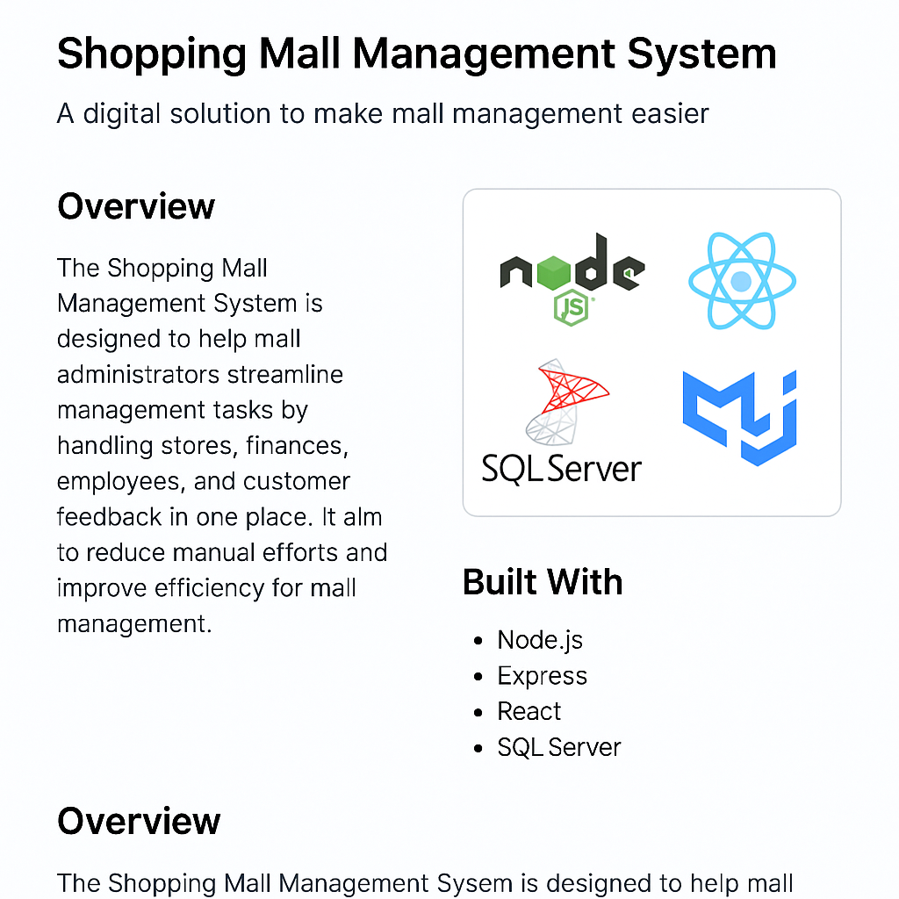

# 🏬 Shopping Mall Management System

A digital solution to make mall management easier.

## 🧾 Overview

The Shopping Mall Management System is designed to help mall administrators streamline everyday management tasks. It provides an all-in-one platform to manage stores, finances, employees, and customer interactions. The goal is to reduce manual efforts and bring smart, data-driven control to shopping malls—especially with the rapid retail growth in Pakistan.

---

## 🚀 Key Features

### 🏪 Store Management
- Store owners can get their businesses registered online.
- Admins can approve, reject, or request changes in store applications.

### 📊 Store Dashboards
- Each store gets a personal dashboard with financial insights and performance analytics.

### 💸 Rent & Invoices
- Auto-generated invoices for rent.

### 🔌 Utility Bills
- Electricity, water, and gas bills are generated and sent to shop owners.

### 📈 Revenue Tracking
- Mall-wide and store-specific revenue reports for financial decision-making.

### 🧾 Expense Management
- Tracks costs like maintenance, salaries, and utilities.

### 👨‍💼 Employee & Attendance Management
- Keep employee records and track attendance easily.

### 💰 Payroll System
- Automatically calculates and sends salaries.

### 🔐 Role-Based Access
- Role-based user access to secure and streamline operations.

### 👨‍💻 Admin & Sub-Admin Panel
- Assign different administrative roles and permissions.

### 🗣️ Customer Feedback
- Customers can leave store reviews and share their experiences.

---

## 🛠️ Tech Stack

| Technology | Role |
|-----------|------|
| **Node.js** | Backend runtime |
| **Express** | Backend framework |
| **React** | Frontend framework |
| **SQL Server** | Database |
| **MUI** | UI Design library |
| **Redux Toolkit** | State management |

---

## 🖼️ System Design



---

## 📂 Folder Structure (Basic Idea)

```bash
frontend/                 # React Frontend
├── public/
├── src/
│   ├── components/
│   ├── pages/
│   ├── redux/
│   └── App.js

backend/                 # Node.js + Express Backend
├── controllers/
├── routes/
├── models/
├── middleware/
└── index.js
